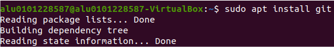
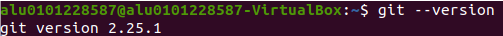
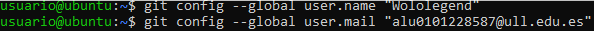
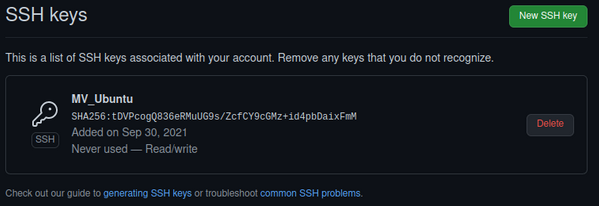
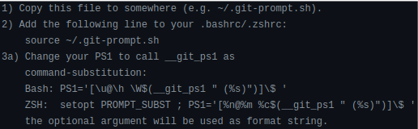
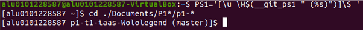

# Práctica 1: IAAS
#### Jaime Simeón Palomar Blumenthal
##### alu0101228587@ull.edu.es
##

## **Índice**

1. [Objetivo de la práctica.](#objetivo)
2. [Instalación de Homebrew for Linux.](#homebrew)
3. [Instalación de Git.](#git)
4. [Configuración de Git Prompt.](#git_prompt)
5. [Alias de comandos en Git (Git aliasses).](#git_aliasses)
6. [Instalación de NVM, Node y extensiones.](#nvm)
7. [Instalación de RVM y Ruby.](#rvm)
8. [Instalación y uso de NERDTree.](#nerdtree)
9. [Puesta en marcha de una aplicación web.](#webapp)

<a name="objetivo"><a>
## **1. Objetivo de la práctica**

En esta práctica se pretende instalar **todos los programas y extensiones** necesarias para realizar las diferentes actividades de la asignatura.

<a name="homebrew"><a>
## **Instalación de Homebrew for Linux**

Seguimos los pasos indicados en la [**página principal de Homebrew**][homebrew_web], es decir, ejecutamos la siguiente instrucción:

`/bin/bash -c "$(curl -fsSL https://raw.githubusercontent.com/Homebrew/install/HEAD/install.sh)"`

Es posible que tengamos que instalar **curl** ejecutando `sudo apt install curl` en la terminal.

[homebrew_web]: https://brew.sh/index_es

<a name="git"><a>
## **2. Instalación de Git**

Para realizar la instalación del sistema de control de versiones emplearemos el gestor de paquetes nativo de Unix: **APT**. En la terminal ejecutaremos `sudo apt install git`:

Y para comprobar que todo ha sido instalado correctamente ejecutamos `git --version` para conocer la versión del software que hemos instalado:

También deberemos seguir la [**documentación ofrecida en Github**][github_doc] para la configuración inicial de Git. Básicamente configuraremos el **nombre de usuario** y **email** de Git para que coincidan con los de nuestra **cuenta de Github.**

Además, también tendremos que [**generar una clave SSH y verificarla en Github**][ssh_key].

En Github podremos agregarla desde _Configuración > Claves SSH y GPG_.

[github_doc]: https://docs.github.com/es/get-started/quickstart/set-up-git
[ssh_key]: https://docs.github.com/en/authentication/connecting-to-github-with-ssh

<a name="git_prompt"><a>
## **3. Configuración de Git Prompt**

La instalación de **Git Prompt** es relativamente **sencilla**. En el propio [**archivo de instalación**][gitprompt_install] se explican los pasos a seguir. Hay que tener en cuenta que las características de esta extensión **sólo se mostrarán cuando estemos dentro de un repositorio**. En otras palabras, sólo sabrás que estás en una rama concreta cuando estés en ella dentro del repositorio.

Una vez hayamos finalizado la configuración y estemos **dentro de un repositorio**, se nos mostrará algo similar a esto:

En esta imagen podemos observar que se ha editado la variable del sistema _PS1_ para que el símbolo del sistema sólamente muestre el **nombre de usuario, la carpeta actual y la rama en la que nos encontramos**.

Otro valor recomendado para _PS1_ es el siguiente. Nos pone el **nombre de usuario en azul y la rama en la que nos encontremos en verde**, además de formatearlo todo a negrita para mayor claridad.

Otro **posible valor** para _PS1_ o formato para el símbolo del sistema puede ser el siguiente.

`PS1='$(tput bold)[$(tput setaf 4)\u $(tput sgr0)$(tput bold)\W $(tput setaf 2)$(__git_ps1 " (%s)")$(tput sgr0)$(tput bold)]\$ $(tput sgr0)'`

[gitprompt_install]: https://github.com/git/git/blob/master/contrib/completion/git-prompt.sh

<a name="git_aliasses"><a>
## 5. Alias de comandos en Git (Git Aliasses)

A la hora de utilizar **Git**, va a haber comandos con varias opciones que tengamos que utilizar **repetidamente**, por lo que nos convendrá crear alias para estos. Para ello, utilizamos el siguiente comando:

`git config --global alias.amend 'commit --amend'`

En este caso estamos creando el **alias** _git amend_ para utilizar el comando `git commit --amend`, que sobreescribe el último commit hecho por el usuario.
