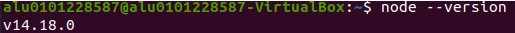
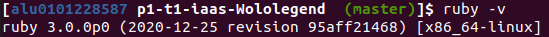
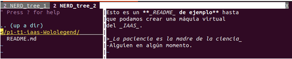
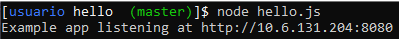
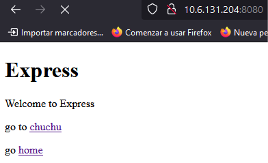

# Práctica 1: IAAS
#### Jaime Simeón Palomar Blumenthal
##### alu0101228587@ull.edu.es
##

## **Índice**

1. [Objetivo de la práctica.](#objetivo)
2. [Instalación de Homebrew for Linux.](#homebrew)
3. [Instalación de Git.](#git)
4. [Configuración de Git Prompt.](#git_prompt)
5. [Alias de comandos en Git (Git aliasses).](#git_aliasses)
6. [Instalación de NVM, Node y extensiones.](#nvm)
7. [Instalación de RVM y Ruby.](#rvm)
8. [Instalación y uso de NERDTree.](#nerdtree)
9. [Puesta en marcha de una aplicación web.](#webapp)

<a name="objetivo"><a>
## **1. Objetivo de la práctica**

En esta práctica se pretende instalar **todos los programas y extensiones** necesarias para realizar las diferentes actividades de la asignatura.

<a name="homebrew"><a>
## **Instalación de Homebrew for Linux**

Seguimos los pasos indicados en la [**página principal de Homebrew**][homebrew_web], es decir, ejecutamos la siguiente instrucción:

`/bin/bash -c "$(curl -fsSL https://raw.githubusercontent.com/Homebrew/install/HEAD/install.sh)"`

Es posible que tengamos que instalar **curl** ejecutando `sudo apt install curl` en la terminal.

[homebrew_web]: https://brew.sh/index_es

<a name="git"><a>
## **2. Instalación de Git**

Para realizar la instalación del sistema de control de versiones emplearemos el gestor de paquetes nativo de Unix: **APT**. En la terminal ejecutaremos `sudo apt install git`:


Y para comprobar que todo ha sido instalado correctamente ejecutamos `git --version` para conocer la versión del software que hemos instalado:


También deberemos seguir la [**documentación ofrecida en Github**][github_doc] para la configuración inicial de Git. Básicamente configuraremos el **nombre de usuario** y **email** de Git para que coincidan con los de nuestra **cuenta de Github.**


Además, también tendremos que [**generar una clave SSH y verificarla en Github**][ssh_key].

En Github podremos agregarla desde _Configuración > Claves SSH y GPG_.


[github_doc]: https://docs.github.com/es/get-started/quickstart/set-up-git
[ssh_key]: https://docs.github.com/en/authentication/connecting-to-github-with-ssh

<a name="git_prompt"><a>
## **3. Configuración de Git Prompt**

La instalación de **Git Prompt** es relativamente **sencilla**. En el propio [**archivo de instalación**][gitprompt_install] se explican los pasos a seguir. Hay que tener en cuenta que las características de esta extensión **sólo se mostrarán cuando estemos dentro de un repositorio**. En otras palabras, sólo sabrás que estás en una rama concreta cuando estés en ella dentro del repositorio.


Una vez hayamos finalizado la configuración y estemos **dentro de un repositorio**, se nos mostrará algo similar a esto:


En esta imagen podemos observar que se ha editado la variable del sistema _PS1_ para que el símbolo del sistema sólamente muestre el **nombre de usuario, la carpeta actual y la rama en la que nos encontramos**.

Otro valor recomendado para _PS1_ es el siguiente. Nos pone el **nombre de usuario en azul y la rama en la que nos encontremos en verde**, además de formatearlo todo a negrita para mayor claridad.

Otro **posible valor** para _PS1_ o formato para el símbolo del sistema puede ser el siguiente.

`PS1='$(tput bold)[$(tput setaf 4)\u $(tput sgr0)$(tput bold)\W $(tput setaf 2)$(__git_ps1 " (%s)")$(tput sgr0)$(tput bold)]\$ $(tput sgr0)'`

[gitprompt_install]: https://github.com/git/git/blob/master/contrib/completion/git-prompt.sh

<a name="git_aliasses"><a>
## 5. Alias de comandos en Git (Git Aliasses)

A la hora de utilizar **Git**, va a haber comandos con varias opciones que tengamos que utilizar **repetidamente**, por lo que nos convendrá crear alias para estos. Para ello, utilizamos el siguiente comando:

`git config --global alias.amend 'commit --amend'`

En este caso estamos creando el **alias** _git amend_ para utilizar el comando `git commit --amend`, que sobreescribe el último commit hecho por el usuario.

<a name="nvm"><a>
## 6. Instalación de NVM, Node y extensiones.

Para instalar el **gestor de versiones de Node** (NVM) ejecutamos el siguiente comando y **reiniciamos la Terminal**:

`wget -qO- https://raw.githubusercontent.com/nvm-sh/nvm/v0.38.0/install.sh | bash`

Una vez esté instalado, podemos utilizarlo para **instalar la última versión de Node** ejecutando `nvm install --lts`



Seguidamente, ejecutaremos `npm install -g jshint` para instalar **JSHint**, una aplicación para **detectar errores** en el funcionamiento de **código JavaScript**.

Por otro lado, **ExpressJS** es una extensión de Node para trabajar sobre JavaScript. Para instalarlo, previamente debemos haber **instalado y configurado NVM y Node**. Ejecutamos `npm install express-generator -g` en la Terminal.

<a name="rvm"><a>
## 7. Instalación de RVM y Ruby

RVM es el **gestor de versiones de Ruby**. Para instalarlo primero debemos tener a punto software-properties-common, por lo que ejecutamos lo siguiente en la **consola**:

`sudo apt-get install software-properties-common`

Seguimos con la descarga del **paquete de instalación de RVM**:

```shell
sudo apt-add-repository -y ppa:rael-gc/rvm
sudo apt-get update
sudo apt-get install rvm
```

Y **cambiamos de usuario** de RVM al nuestro:

`sudo usermod -a -G rvm $USER`

_$USER_ almacena el **nombre del usuario actual**. Si quisiéramos añadir a otro usuario, cambiamos esta variable por el nombre de usuario correspondiente.

**Reiniciamos** el equipo o máquina virtual para aplicar todos los cambios y habilitamos los paquetes de gemas e instalamos Ruby:

```shell
rvm user gemsets
rvm install ruby
```

Podemos ejecutar `ruby -v` para comprobar que todo ha sido instalado correctamente.



<a name="nerdtree"><a>
## 8. Instalación y uso de NERDTree

**NERDTree** es un **gestor de archivos** para Vim, que permite movernos visualmente en jerarquías de archivos complejas. Para instalarlo, si disponemos de **VIM 8.0 o superior**, simplemente ejecutamos las siguientes instrucciones en la Terminal. Para conocer **nuestra versión de Vim** ejecutamos `vim --version`.

```shell
git clone https://github.com/preservim/nerdtree.git ~/.vim/pack/vendor/start/nerdtree
vim -u NONE -c "helptags ~/.vim/pack/vendor/start/nerdtree/doc" -c q
```

Las otras **opciones de instalación** consisten en [utilizar un gestor de extensiones de Vim externo][tutorial_gestor_externo], y no el nativo de las últimas versiones.



Para abrir **NERDTree**, primero **abrimos un archivo** con Vim, y ejecutamos `:NERDTree`. Estos son algunos de las posibles acciones:

* _t_: Abrir el archivo seleccionado en una nueva pestaña.
* _m_: Muestra el menú de NERDTree.
* _?_: Muestra la guía rápida de NERDTree.

Para acceder a la **documentación** de NERDTree ejecutamos `:help NERDTree` en Vim.

[tutorial_gestor_externo]: https://github.com/preservim/nerdtree

<a name="webapp"><a>
## 9. Puesta en marcha de una aplicación web

Una vez configurada y ejecutada, la **aplicación de ejemplo** que se propone en la práctica queda de esta forma en la Terminal:



Y de esta otra accediendo a **nuestra máquina a través del puerto 80**:



### Cómo poner una aplicación en marcha

1. Crea el directorio del proyecto o el proyecto en sí.
   * `mkdir (nombre-proyecto)` ó `express (nombre-proyecto)`

2. Instala las dependencias.
   * `npm install`

3. Codifica la aplicación en un fichero JavaScript.

4. Ejecuta el fichero con Node.
   * `node (nombre_fichero).js`

5. Accede a la URL local indicada por Node.

6. ¡Éxito!

